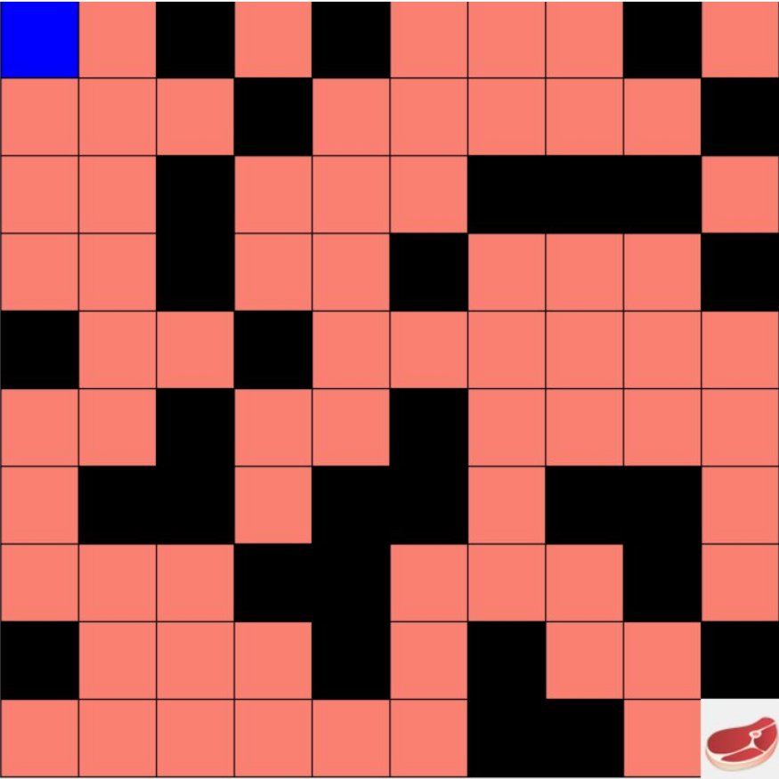
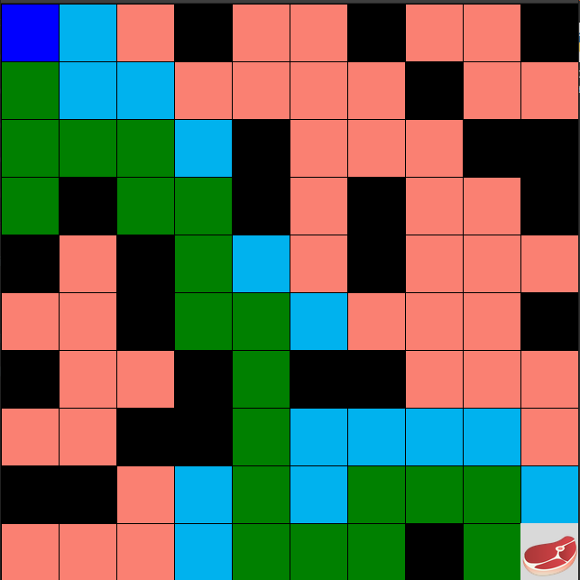
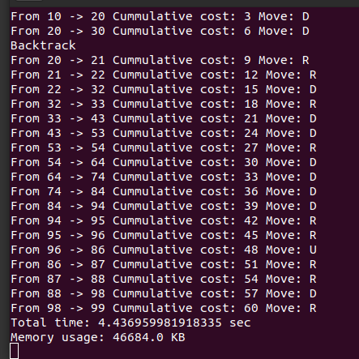

# Maze-Problem
A Lion lives in a world with twisted and molded corridors and rounded treats. Navigation to the
world is not straightforward due to the twisting nature of surroundings. Efficient navigation is Lion's
first and foremost goal to find food (meat).  
 
The Lion starts at the starting point (blue cell) of the grid while the meat is at the bottom right corner,
as shown in the figure below: 

  

 

Problem type 1: Finding Food using Depth First Search  
The graph search version of DFS , ​ which avoids expanding any
already visited states. Let's consider each step incurs a cost of 3 units,
And find the total cost for the Lion in the case of DFS.   

Problem type 2: Finding Food using Breadth-First Search  
The graph search version of BFS , ​ which avoids expanding any
already visited states. Let's consider each step incurs a cost of 5 units,
And find the total cost for the Lion in the case of DFS.   

Problem type 3: Finding Food using Varying the Cost Function  
BFS may or may not find the best solution, but our task is to find the best
or optimal solution. For this, implement a Varying Cost Search (VCS) algorithm.

Using the following cost function: For each step, the cost of vertical movement  
towards the target is 3 units otherwise the step cost is always 2 units.   

Problem type 4: Finding Food using A* search  
A* takes a heuristic function as an argument. The heuristics function here takes  
two arguments: a state in the search problem (the main argument) and the search  
problem itself (for reference information). Manhattan distance heuristic is used.
  

Here is one of the output: 

  
    

The reports about time complexity, algorithm’s completeness, data structure used, and   optimality is attached (q1-4-lion-maze.pdf).

